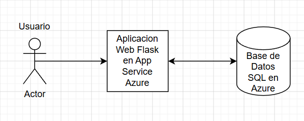

Gestión de Tareas

Josean C. Jiménez Pagan Y00582460
jjimenez2460@arecibointer.edu

Describe brevemente tu aplicación:
- ¿Qué hace?
    La aplicación te permite registrar tareas que tengas que realizar, al realizar ya las tareas, le das al botón de echo y te marca la tarea echa. También te permite borrar la tarea si ya no la debes de hacer.

- ¿A quién va dirigida?
    Va dirigido a estudiantes, profesores y hasta un equipo de trabajo lo puede utilizar. Ya que tiene un método estructurado para monitorear las tareas del día a día.

- ¿Qué problema resuelve o qué funcionalidad ofrece?
    El problema que resuelte es que puedes tener tus tareas del diario organizadas, con esta aplicación puedes tener en orden las tareas que te toca hacer durante el día.

---

Enumera los servicios usados (deben estar dentro de los recursos gratuitos):
| Servicio              | Propósito dentro del proyecto                    | Gratuito en Azure for Students |
|-----------------------|--------------------------------------------------|--------------------------------|
| Azure App Service     | Aloja la aplicación y la despliega para que sea  | ✅ Sí                          |
|                       |  accesible a los usuarios                        |                                 
| Azure SQL Database    | Almacena de forma segura los datos de los        | ✅ Sí                          |
|                       | usuarios y sus tareas       

---

Diagrama de Arquitectura

Despliegue y Configuración

1. Preparación Local
Describe los pasos para instalar, correr y probar tu aplicación localmente.

    Para poder correr el proyecto, primero se debe clonar el repositorio para tenerlo en la máquina de uno. Para después crear un entorno asilado y virtual, el cual no es obligatorio, pero en mi caso lo hice con el entorno virtual. También si es necesario hay que instalar las dependencias necesarias para que el código corra sin problema.

2. Configuración en Azure
   
    Se realizaron varios pasos para poderlo configurarlo en Azure, empezando, creando un App Service para poder implementar el proyecto. Después se configuraron las Variables de Entorno para tener una buena seguridad y que el código fuente sea expuesto. Las variables declaradas fueron: SQL_SERVER para la dirección del servidor de la base de datos, SQL_DATABASE nombre de la base de datos, SQL_USERNAME usuario de administrador de la base de datos y, por último, SQL_PASSWORD contraseña del administrador. Y lo último que se configuro fue la base de datos en SQL con sus respectivas reglas para poderme conectar sin problema al proyecto. 

Enlace a la Aplicación Desplegada
> [https://proyecto-final-cloud-b2bufbg0d0h9auef.eastus-01.azurewebsites.net/]

---

Estimación del Costo (Azure Pricing Calculator)
    Si el proyecto se ejecutara si el beneficio del costo gratis, escogiendo las cosas básicas sería un precio de 285 dólares con el App Service y la Base de Datos SQL. 
    
    
    
    

---

Capturas del Portal de Azure

 
\

---

Lecciones Aprendidas
- ¿Qué retos enfrentaron y cómo los resolvieron?
    El mayor reto que enfrente fue en configurar todo para que todo corriera correctamente. Otro problema que enfrente fue el hecho de configurar la IP en Azure para que la IP de la laptop y la de Azure coincidieran para que se conectaran correctamente.

- ¿Qué aprendieron sobre trabajar con servicios cloud?
    En este trabajo aprendí los pasos y los servicios necesarios para poder tener una aplicación web pública. Aprendí también sobre los costos que requieren para poder tener una aplicación pública. Y una de las cosas más importante en la que aprendí en este trabajo fue sobre la seguridad necesaria para un proyecto como este.

- ¿Qué mejorarían en una próxima versión del proyecto?
    En una próxima versión mejoraría el hecho de que le envíe al usuario un recordamiento sobre las tareas pendientes. También agregaría una función para que el usuario pueda elegir el día o hora en el cual necesite hacer esa tarea que tenga pendiente.

---

Repositorio del Código
Incluye el link al repositorio de GitHub (debe estar público o accesible para el profesor):
> [Enlace al repositorio del proyecto](https://github.com/Josean9822/Proyecto-Final-COMP4260)
